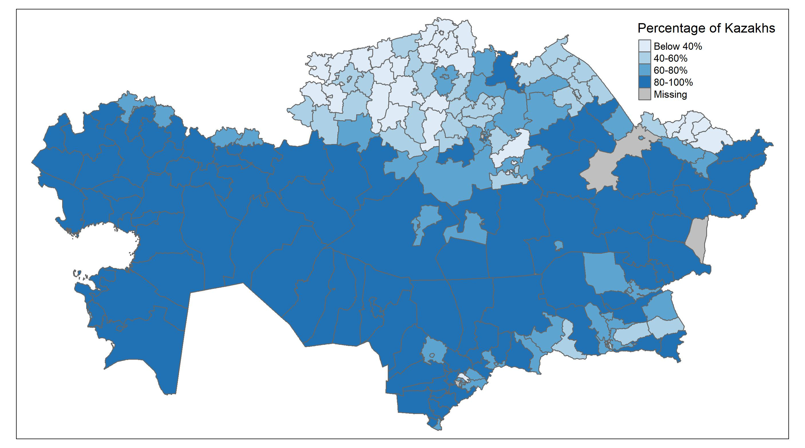

# The ratio of Kazakhs in the regions of Kazakhstan

I made a map of the percentage of Kazakhs in the regions of Kazakhstan 🇰🇿 

I developed this visualization using the R programming language using the libraries: devtools, geokz, dpls, sf, tmap.

Looking at this map, we can draw several conclusions:

1. South of Kazakhstan: High concentration of Kazakhs (80-100%).
2. North and East: Low concentration of Kazakhs (below 40%).
3. Central regions: Diversity in the percentage of Kazakhs (40-80%).
4. Western regions: High concentration of Kazakhs, especially in Mangistau and Atyrau regions.
5. Historical influence: Northern regions with a lower concentration of Kazakhs may reflect the historical influence of Soviet industrialization and resettlement.

The highest concentration is in the area of Aksuat (Abai), where the percentage of Kazakhs is 99.5%.
The lowest concentration is in the Fedorovka district (Kostanai), where the percentage of Kazakhs is 21%. ​
